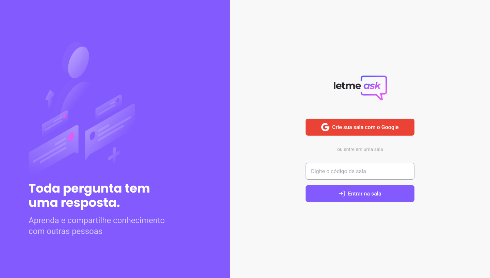
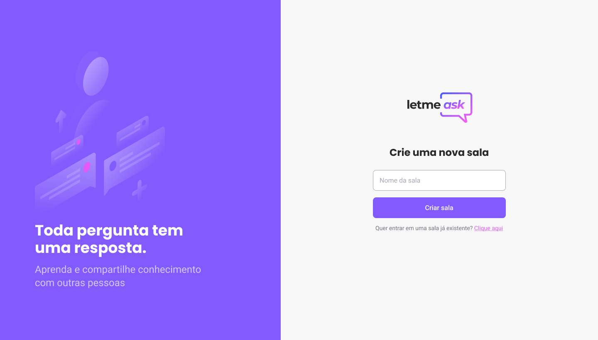

<h1 align="center">
    
</h1>

  <a href="#rocket-tecnologias">Tecnologias</a>&nbsp;&nbsp;&nbsp;|&nbsp;&nbsp;&nbsp;
  <a href="#-projeto">Projeto</a>&nbsp;&nbsp;&nbsp;|&nbsp;&nbsp;&nbsp;
  <a href="#memo-licença">Licença</a>

 

  

 

  
  

  

# 🚀 Tecnologias

### Esse projeto foi desenvolvido com as seguintes tecnologias:

## - [React](https://reactjs.org)
## - [Firebase](https://console.firebase.google.com/)
 
  

# 💻 Projeto

### LetMeAsk é uma plataforma onde usuários criam salas para fazer perguntas. O administrador da plataforma pode rejeitar ou responder as perguntas. 
 

### O usuário do LetMeAsk pode acessar uma sala existente ou criar uma nova sala. Para inserir uma pergunta, é necessário fazer login utilizando as credenciais de uma conta da Google.
 

### O administrador da plataforma pode aceitar perguntas feitas por usuários, rejeitar/apagar perguntas e fazer novas perguntas. 
  

# Licença

Esse projeto está sob a licença MIT. Veja o arquivo [LICENSE](LICENSE.md) para mais detalhes.

---
